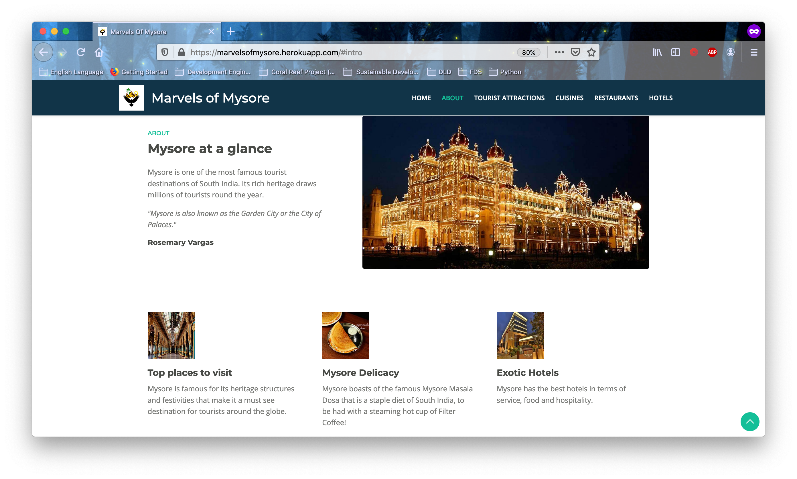
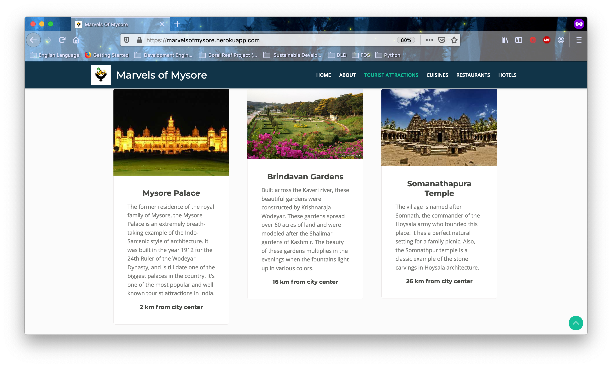
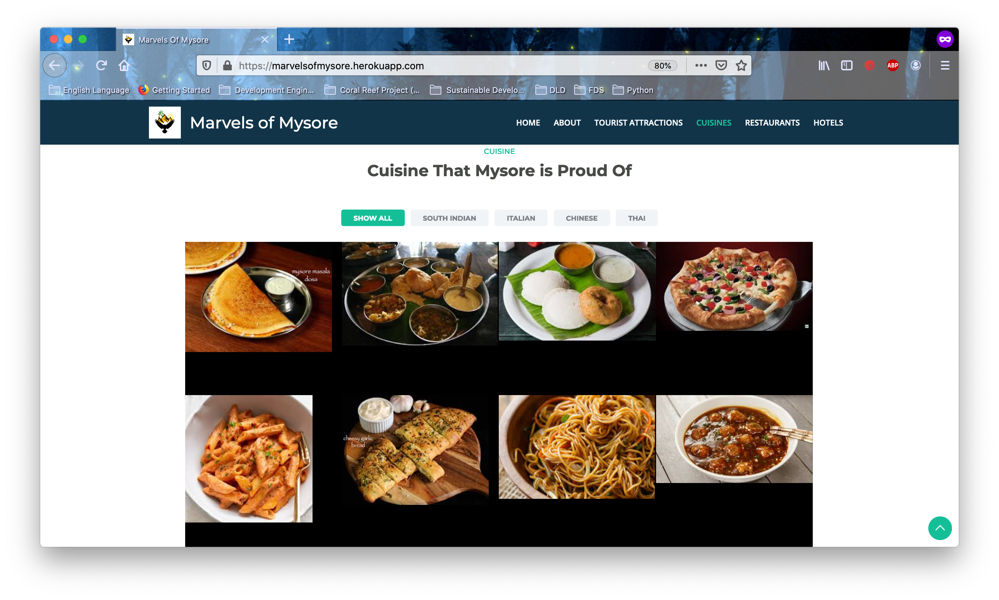
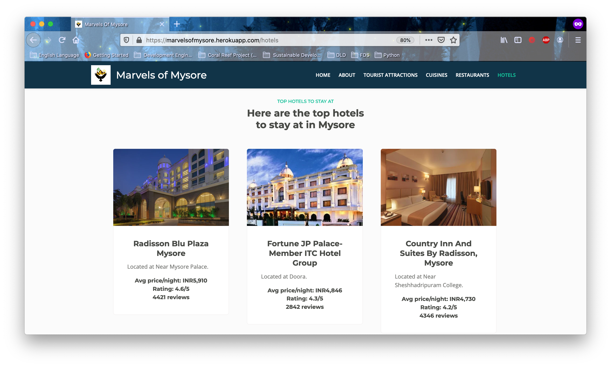

# CodAvengers

## Mysore Tourism Website Track

The project we are doing for Code-Off-Duty Hackathon.

### What we are doing:

Implementing a tourism website which gives results based on the Mysore hotels (fetches from the database), restaurants, specialities, and reviews based on user experience.

### What issues are we addressing:

People often have to visit and search through various many websites when they are planning their trip to Mysore (or any other place). We reduce the hastle by connecting them to the various mediums in a single place. 

### Features included:

- Captivating web pages to enhance tourism.
- Complete working website with information for tourists.

### Tech Stack:

- HTML5
- CSS3
- Bootstrap (Framework for CSS)
- Javascript
- Flask
- SQLite

### Sneak-peak into our website in-making:

